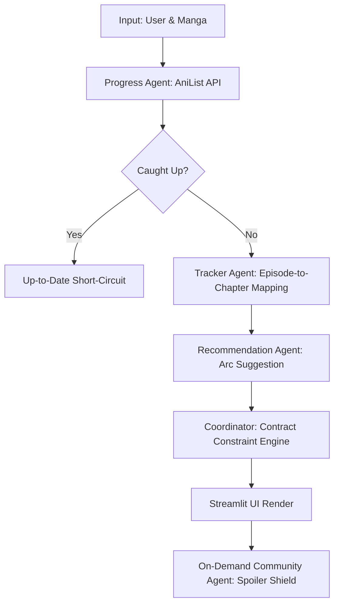

# MangaScope 🎌 — Multi-Agent Anime-to-Manga Transition Orchestrator

MangaScope is an intelligent multi-agent manga reading companion. It solves a ubiquitous challenge for anime and manga enthusiasts: **transitioning from watching an anime adaptation to reading the original manga source material without spoilers, narrative regressions, or tedious manual searches.**

Typically, anime seasons end mid-way through a manga's publication cycle. Viewers wanting to continue the story are forced to browse community wikis, fan forums, or search engines to find where to start. MangaScope addresses this by coordinating a team of specialized AI agents built on **Gemini 2.5 Flash** with **Google Search Grounding**, paired with an upfront deterministic verification layer, structured schemas, memory personalization, and orchestrator-level contract enforcement.

---

## 🏗️ System Architecture & control Flow

MangaScope operates as a linear, staged pipeline coordinated by a central orchestrator. The pipeline is designed around the principle of **"deterministic first, probabilistic fallback second"** to guarantee speed, reduce API token usage, and ensure correctness.



### Core Pipeline Steps:

1. **Input Sanitization & Memory Personalization**: The orchestrator validates the AniList username and manga series name, then queries local storage to see if a cached reading state exists from a prior session.
2. **User Progress Identification**: The Progress Agent executes a GraphQL query to AniList to discover the user's exact chapter progress, reading status, and the manga's publication details.
3. **Upfront Caught-Up Evaluation**: A programmatic checks layer evaluates whether the reader is already caught up. If so, it triggers an upfront short-circuit that bypasses subsequent LLM queries.
4. **Adaptation Mapping**: For active readers, the Adaptation Tracker Agent resolves where the anime ended. It queries local verified mappings first (High Confidence) and falls back to a web-grounded search query (Low Confidence) if no mapping is cached.
5. **Arc Path Recommendation**: The Recommendation Agent determines the boundaries of the upcoming story arc starting from the safe resume chapter, requesting a search-grounded suggestion.
6. **Coordinator Boundary Enforcement**: The orchestrator applies post-processing contract checks, correcting suggested chapter bounds if they violate progress constraints.
7. **On-Demand Spoiler Shielding**: The Community Context Agent is delayed until the user clicks a fetch button in the UI, retrieving and verifying fan discussions on-demand.

---

## 🚀 Installation & Setup Guide

Get MangaScope running locally in 5 simple steps:

### Step 1: Clone the Repository

Clone the project from GitHub and navigate into the project directory:

```bash
git clone https://github.com/Krishna2805/MangaScope-Multi-Agent-Manga-Reading-Companion.git
cd MangaScope-Multi-Agent-Manga-Reading-Companion
```

### Step 2: Set up a Virtual Environment

Set up an isolated environment to manage dependencies:

```bash
# Create virtual environment
python -m venv venv

# Activate it (Windows PowerShell)
.\venv\Scripts\Activate.ps1

# Activate it (macOS/Linux)
source venv/bin/activate
```

### Step 3: Install Requirements

Install all required libraries and dependencies:

```bash
pip install -r requirements.txt
```

### Step 4: Configure Environment Variables

MangaScope requires a Gemini API Key to run web search grounding. Copy the template configuration file:

```bash
# Copy example file
cp .env.example .env
```

Open the newly created `.env` file and insert your API key:

```env
GEMINI_API_KEY=your_gemini_api_key_here
```

### Step 5: Start the Streamlit Application

Launch the interactive web portal locally:

```bash
streamlit run app.py
```

This will automatically open the dashboard in your default browser at `http://localhost:8501`.

---

## 📖 How to Run & Verify Results

To test the multi-agent pipeline and observe the results:

1. **Enter Inputs**:
   - **AniList Username**: Enter a valid username (or a test username like `abcde`).
   - **Manga Series**: Enter a series you want to look up (e.g. `Oshi no ko`, `One Piece`, `Solo Leveling`).
2. **Launch Agent**: Click the **🚀 Run Agent** button.
3. **Understand Your Results**:
   - **Your Progress Card**: Displays live AniList status columns (`Status`, `Chapters Read`, `Volumes Read`, `Score`).
   - **Anime Adaptation Card**: Displays the current status of the anime adaptation. If it was resolved dynamically via web search (Confidence: `LOW`), a **🔒 Verify & Lock Mapping** button will appear. Clicking it commits and locks the mapping into your local database.
   - **What to Read Next Card**: Shows the recommended upcoming story arc, target chapter range, and estimated chapters remaining.
   - **Community Buzz Card (Spoiler Shield)**: To prevent spoilers, the agent is skipped initially. Click **💬 Fetch Community Buzz** to load current fan theories and discussions on-demand.

---

## 🔒 Privacy & Local State Management

MangaScope keeps your local environment private and separates your runtime files from the shared code repository:

- **`memory.json`**: Caches your personal run history. It is ignored by Git.
- **`agents/verified_mappings.json`**: Stores mappings you verify and lock locally. It is untracked and excluded from version control to prevent system layout leaks.
- **`mangascope_trace.json`**: Logs execution logs and tool paths. Ignored by Git.

These rules are enforced via `.gitignore` to ensure your data stays on your machine.
