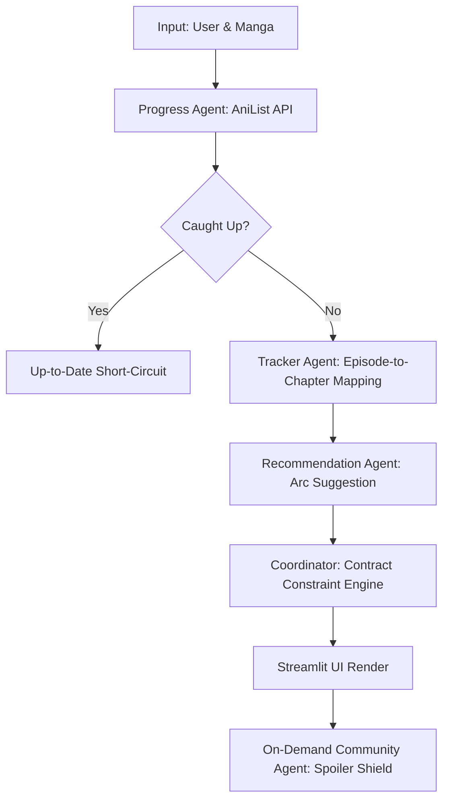

# MangaScope 🎌 — Multi-Agent Anime-to-Manga Transition Orchestrator

MangaScope is an intelligent multi-agent manga reading companion. It queries your AniList reading history, maps the corresponding anime adaptation's endpoint, identifies what chapters/arcs you should read next, and fetches active community discussions.

---

## 🏗️ Architecture & Pipeline Flow



### Core Architecture Components
1. **Coordinator Agent (`coordinator.py`)**: Runs the pipeline sequentially, loads personalization memory, runs upfront caught-up short-circuits, normalizes all agent exceptions, performs post-generation contract checks, and synthesizes the trace logs (`mangascope_trace.json`).
2. **Progress Agent (`agents/progress_agent.py`)**: Queries the AniList GraphQL API to fetch the user's reading status, score, volumes read, and total published chapters. Declares skills: `anilist_query`, `reading_status_extraction`.
3. **Adaptation Tracker Agent (`agents/tracker_agent.py`)**: Maps anime episodes to manga chapters. Uses a verified local mapping database, falling back to Gemini 2.5 Flash Web Search Grounding. Features user mapping locking and cache validation. Declares skills: `anime_manga_mapping`, `chapter_alignment`.
4. **Recommendation Agent (`agents/recommendation_agent.py`)**: Determines the next story arc. Uses Gemini 2.5 Flash Web Search Grounding with safe resume boundary enforcement. Declares skills: `arc_recommendation`, `constraint_reasoning`.
5. **Community Context Agent (`agents/community_agent.py`)**: Gathers fan discussion summaries on-demand (Spoiler Shield). Verifies search grounding metadata binary search retrieval before rendering. Declares skills: `web_retrieval`, `discussion_summarization`.
6. **Model Context Protocol Tool Registry (`mcp_tools/mcp_server.py`)**: Abstraction layer that centralizes all external API queries (GraphQL and Gemini generative requests). All agents make calls through this unified tool interface.

---

## 🚀 Installation & Usage

1. **Install requirements**:
   ```bash
   pip install -r requirements.txt
   ```
2. **Create a `.env` file in the project root**:
   ```env
   GEMINI_API_KEY=your_gemini_api_key
   ```
3. **Run the Streamlit application**:
   ```bash
   streamlit run app.py
   ```

For detailed demo scenarios, step-by-step instructions, and dynamic databases checks, refer to the [Demo Guide](demo.md).
For a breakdown of fixed bugs, security features, and technical significance, check the [Progress Report](progress_report.md).
For the Kaggle Capstone Project description writeup, see the [Kaggle Project Description](kaggle_project_description.md).
